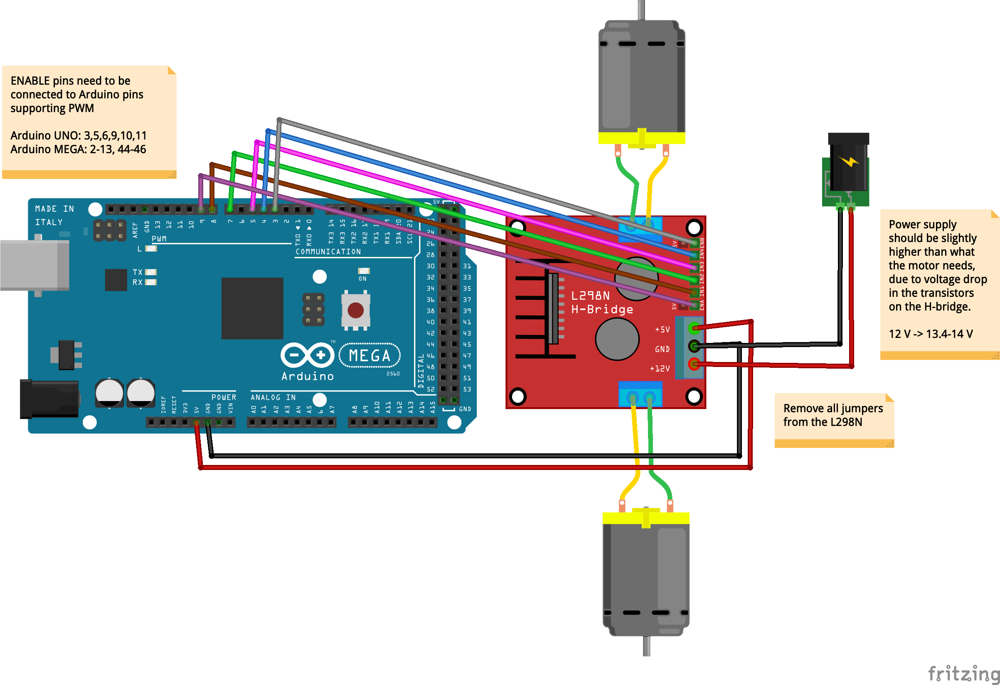
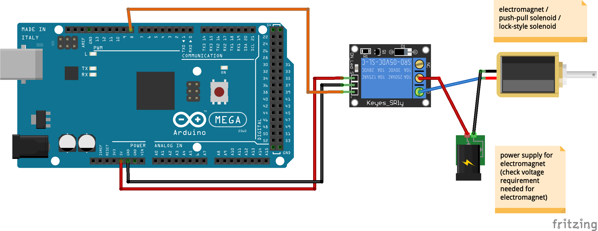

# arduino-actuators

Scripts to use for various actuators with Arduino

Note: there are separate repos for working with servos and stepper motors.

Wiring diagram - DC motor and the L298N Dual H-Bridge

Wiring diagram - Electromagnet:

