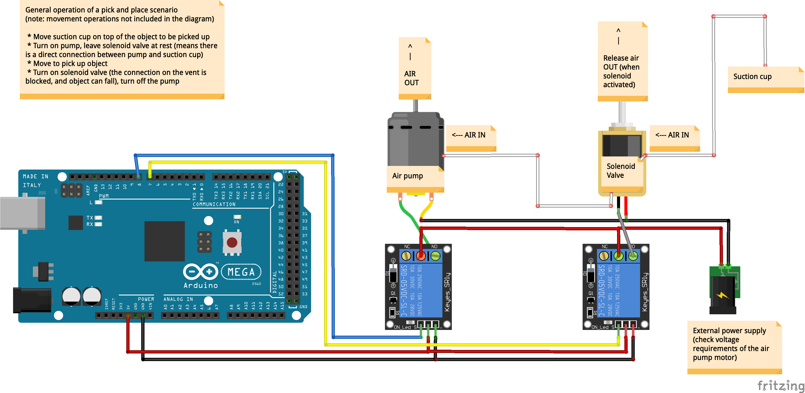

# arduino-actuators

Scripts to use for various actuators with Arduino

Note: there are separate repos for working with servos and stepper motors.

Wiring diagram - DC motor and the L298N Dual H-Bridge

Wiring diagram - Electromagnet (same for Push-Pull Solenoid Electromagnet / or Lock-type Solenoid) - using a relay:

Wiring diagram - Electromagnet - using a transistor:

Wiring diagram - Fan (simple setup to just on or off, no speed control):

Wiring diagram - Vacuum Suction Pump - using relays:

Wiring diagram - Vacuum Suction Pump - using transistors:

Wiring diagram - LED:

